# Sonic mood

Sonic Mood is an AI-powered music recommendation app that demonstrates how to deploy semantic search at scale using [Render](https://render.com) and [pgvector](https://github.com/pgvector/pgvector). Enter a mood or vibe, and receive a personalized playlist drawn from over 12 million songs.

This application showcases how to use [pgvector](https://github.com/pgvector/pgvector) with Render’s Postgres resources using the [installation steps](https://github.com/pgvector/pgvector?tab=readme-ov-file#installation) and a `CREATE EXTENSION vector;` command.

## Demo


https://github.com/user-attachments/assets/612c327b-e6e9-4648-bf24-3795e0d9a379


## Quickstart

### Prerequisites

- Python 3.9+
- Git
- [Render](https://render.com) account (free tier available)
- [Fireworks AI](https://fireworks.ai) account with billing enabled
- [Spotify Developer](https://developer.spotify.com) account (free)

### Steps

1. **Clone the repository**
   ```bash
   git clone https://github.com/yourusername/Render-PGVector-Music-Recommender.git
   cd Render-PGVector-Music-Recommender
   ```

1. **Create a PostgreSQL database on Render**
   - Log in to your [Render Dashboard](https://dashboard.render.com/)
   - Click "New +" → "PostgreSQL"
   - Choose a name for your database
   - Select your preferred region
   - Choose the free tier or a paid plan
     - This project uses a Basic-256mb paid plan with 5 GB storage (~$7.50/month)
   - Click "Create Database"
   - Once created, copy the "External Database URL" from the database dashboard to use for local development
     - Once your backend service is deployed, replace that key with the "Internal Database URL"
     - Continue to use the external URL for data processing steps

1. **Set up Fireworks AI API key**
   - Sign up at [Fireworks AI](https://fireworks.ai)
   - **Important**: Enable billing in your account settings (required for API access)
   - Navigate to [API Keys](https://fireworks.ai/account/api-keys)
   - Click "Create API Key" and copy the generated key

1. **Set up Spotify API credentials**
   - Go to [Spotify Developer Dashboard](https://developer.spotify.com/dashboard)
   - Log in with your Spotify account
   - Click "Create app"
   - Fill in app name and description
   - Set "Redirect URI" to `http://localhost:8000` (or any valid URL)
   - Accept the terms and click "Save"
   - Copy your "Client ID" and "Client Secret"

1. **Configure environment variables**
   ```bash
   cd backend-web-service
   cp .env.example .env
   ```
   
   Edit the `.env` file and add your credentials:
   ```
   FIREWORKS_API_KEY=your_actual_fireworks_api_key
   SPOTIFY_CLIENT_ID=your_actual_spotify_client_id
   SPOTIFY_CLIENT_SECRET=your_actual_spotify_client_secret
   POSTGRES_URL=your_render_external_database_url
   ```

1. **Run data processing steps:**
   - Run `data-processing/store_songs.py` to enrich the Kaggle song data and store it in PostgreSQL
   - Run `data-processing/generate_embeddings.py` to store vector embeddings in PostgreSQL

1. **Install dependencies and run the backend**
   ```bash
   pip install -r requirements.txt
   python server.py
   ```
   
   The backend will start on `http://localhost:8000`

1. (Optional) View logs
```bash
cd backend-web-service
sanic server
```

1. **(Optional) Run the frontend locally**
   ```bash
   cd ../frontend-site
   npm install
   npm run dev
   ```
   
   The frontend will start on `http://localhost:5173`

For production deployment, see Render's documentation on deploying [web services](https://render.com/docs/web-services) and [static sites](https://render.com/docs/static-sites).

## Architecture

### Diagram

```mermaid
graph LR
    User([👤 User]) -->|Enters mood query| Frontend[🎨 Frontend<br/>Static site]
    
    Frontend -->|API Request| Backend[⚙️ Backend<br/>Python/Sanic]
    
    Backend -->|Embed query| Embedding[🤖 Qwen3-Embedding-8B]
    Backend -->|Generate hypothetical lyrics| HyDE[🤖 Qwen3-235B<br/>HyDE technique]
    
    Embedding -->|Query vector| Backend
    HyDE -->|Hypothetical lyrics| Backend
    
    Backend -->|Vector similarity search| DB[(💾 PostgreSQL + pgvector<br/>12M+ songs with embeddings)]
    
    DB -->|Matching songs| Backend
    
    Backend -->|Fetch track links| Spotify[🎵 Spotify API]
    Backend -->|Generate playlist title| TitleGen[🤖 Qwen3-235B<br/>Playlist naming]
    
    Spotify -->|Song links| Backend
    TitleGen -->|Creative title| Backend
    
    Backend -->|Personalized playlist| Frontend
    Frontend -->|Display results| User
    
    style User fill:#e1d5f7,stroke:#9065d4,stroke-width:3px,color:#000
    style Frontend fill:#e1d5f7,stroke:#9065d4,stroke-width:2px,color:#000
    style Backend fill:#c9b5e8,stroke:#7340b3,stroke-width:2px,color:#000
    style DB fill:#b8ddf7,stroke:#4a8fc7,stroke-width:2px,color:#000
    style Embedding fill:#ffd6a5,stroke:#ff9b42,stroke-width:2px,color:#000
    style HyDE fill:#ffd6a5,stroke:#ff9b42,stroke-width:2px,color:#000
    style TitleGen fill:#ffd6a5,stroke:#ff9b42,stroke-width:2px,color:#000
    style Spotify fill:#caffbf,stroke:#4ade80,stroke-width:2px,color:#000
```



### Components

**Database**: A Render-managed PostgreSQL database with pgvector extension stores 12M+ songs with their metadata, interaction statistics, lyrics, and vector embeddings.

**Backend web service** (Python/Sanic): Handles user queries through the following pipeline:

- Embeds user queries using [`qwen3-embedding-8b`](https://huggingface.co/Qwen/Qwen3-Embedding-8B) via [Fireworks AI](https://fireworks.ai/)
- Generates hypothetical song lyrics matching the query using [`qwen3-235b-a22b-instruct-2507`](https://huggingface.co/Qwen/Qwen3-235B-A22B-Instruct-2507) and [HyDE techniques](https://milvus.io/ai-quick-reference/what-is-hyde-hypothetical-document-embeddings-and-when-should-i-use-it) for improved semantic matching
- Performs vector similarity search against the PostgreSQL database using pgvector, then re-ranks results by popularity score
- Retrieves Spotify links for recommended songs (with in-memory caching)
- Generates creative playlist titles via [`qwen3-235b-a22b-instruct-2507`](https://huggingface.co/Qwen/Qwen3-235B-A22B-Instruct-2507), inspired by Spotify's daylist feature

**Frontend** (Static site): Displays personalized playlists in a modern, responsive UI with glassmorphic elements and responsive design.

**Render deployments**:

- PostgreSQL database with pgvector
- Python backend web service
- Static site frontend

**pgvector**:
- Simplified vectorization types for storage in PostgreSQL
- Simple, expressive semantic search that computes cosine similarity to compare embeddings in a single line of SQL:
```sql
SELECT song_name, band, popularity_score FROM song_embeddings ORDER BY embedding <=> :embedding LIMIT :limit;
```

### Decision rationale

<details>

<summary>Learn the why behind design decisions in this application.</summary>

#### Why Fireworks AI?

Fireworks AI provides enterprise-grade inference infrastructure optimized for speed and reliability. With sub-second response times for both embeddings and LLM generation, it ensures a responsive user experience for real-time music recommendations. Competitive pricing and generous rate limits made it feasible to process embeddings for over 12 million songs during the data preparation phase.

#### Why Qwen models?

The Qwen model family excels at both embedding generation and creative text generation. `qwen3-embedding-8b` produces high-quality 8192-dimensional embeddings that effectively capture semantic meaning in song metadata and lyrics, while remaining more cost-effective than alternatives like OpenAI's embedding models. For text generation, `qwen3-235b-a22b-instruct-2507` provides the creative reasoning needed to generate hypothetical song lyrics and witty playlist titles. Using models from the same family ensures consistent semantic understanding across embedding and generation tasks.

#### Why HyDE (hypothetical document embeddings)?

HyDE significantly improves semantic search accuracy by bridging the gap between user intent and database representation. When a user searches for "songs about feeling lost in a big city," their query embedding may not closely match actual song lyrics about urban isolation. By first generating hypothetical song lyrics that capture the desired vibe, then embedding those lyrics, we create a query representation that's semantically closer to target songs. This implementation combines direct query embeddings with HyDE embeddings to balance precision and diversity.

#### Why combine query and HyDE embeddings?

Combining direct query embeddings with HyDE-generated embeddings balances precision and serendipity. Direct embeddings capture songs that explicitly match user intent, while HyDE embeddings surface unexpected but semantically relevant matches through creative interpretation. This hybrid approach produces more diverse and interesting playlists than either method alone.

#### Why pgvector for semantic search?

pgvector integrates vector similarity search directly into PostgreSQL, eliminating the need for a separate vector database. This simplifies the architecture, reduces operational overhead, and allows seamless joins between vector similarity results and relational data like interaction statistics. Since Render natively supports PostgreSQL with pgvector, it provides a cost-effective solution that scales well for 12+ million song embeddings while maintaining query performance.

#### Why IVFFlat for the `song_embeddings` index (instead of HNSW or similar)?

IVFFlat provides the optimal balance of speed, accuracy, and resource usage for this dataset size. With 12+ million songs, HNSW would require significantly more memory (storing the full graph structure) and longer index build times. IVFFlat's inverted file approach clusters vectors into lists, enabling fast approximate nearest neighbor search with lower memory overhead. Since music recommendations benefit from diverse results rather than absolute precision, IVFFlat's recall-speed tradeoff is ideal—it returns relevant matches quickly while using less memory and supporting faster insertions when adding new songs.

#### Why Polars for data processing?

Polars offers dramatically faster data processing than pandas, especially for the 12+ million song dataset. Its lazy evaluation and query optimization enable efficient joins, aggregations, and transformations without loading entire datasets into memory.

#### Why Sanic for the backend?

Sanic is a production-ready async Python web framework that efficiently handles concurrent requests—essential for an app making multiple sequential API calls per request (HyDE generation, embeddings, database queries, playlist naming, and Spotify lookups). Its async/await support keeps the backend responsive during I/O operations. The lightweight framework also starts quickly on Render's infrastructure and consumes fewer resources than heavier alternatives like Django.

#### Why cache Spotify links?

The Spotify API imposes rate limits and adds latency to each request. Since popular songs appear more frequently in recommendations, caching links in memory (as a simple dictionary) dramatically improves response times for subsequent requests and reduces unnecessary API calls. This straightforward optimization accelerates the user experience without requiring a separate caching layer like Redis.

#### Why upload embeddings to the database in incremental batches?

Data processing uploads local cached embeddings in chunks of 5,000. This is done out of necessity given the constraint of over 12.4M records in the dataset, high-dimensional `vector(2000)` embedding data types, and only a few days to complete the project. The sonic mood application will immediately work while allowing the pool of available songs to expand as more embeddings are loaded into the vector store incrementally.

</details>

## Assumptions

Assumptions I made while building this project:
- Songs data should ideally be enriched with lyrics where possible for comprehensive semantic information in embeddings
- 37 songs without `song_name` values should be filtered out of the dataset since the `song_name` is central to the embedding and thus the recommendation output
- Since only ~1% of songs (128,667 out of 12M+) could be easily enriched lyrics, embeddings generated from song name and band alone are sufficient for meaningful semantic search for the remaining 99% of songs
- IVFFlat's approximate nearest neighbor search is sufficient—perfect precision isn't required since users benefit from diverse, serendipitous recommendations rather than absolute top matches
- The Million Music Playlists Kaggle dataset is representative of broader music listening patterns, and its interaction statistics are reliable indicators of song quality and relevance
- The Spotify API will have links for a sufficient percentage of songs in the dataset to provide meaningful playlists

## Design and style

- Clean, single-page design with responsive layout
- Glassmorphic top bar for modern depth effect
- Modern search bar with keyboard shortcut (`Cmd+K`) functionality
- Purple accents and highlights match Render's signature color and docs styles
- Custom logos created in Canva


## Data processing pipeline

The following one-time data processing steps were performed sequentially:

1. **Data integration**: Joined `track_meta.tsv` and `user_item_interaction.csv` from the [Million Music Playlists Kaggle dataset](https://www.kaggle.com/datasets/usasha/million-music-playlists/data), resulting in 12,431,127 songs

1. **Data cleaning**: Removed 37 rows with null `song_name` values, leaving 12,431,090 valid entries

1. **Interaction statistics**: Enriched songs with user interaction metrics including:
   - `interactions_count`: Total number of user interactions
   - `unique_users`: Number of distinct users who interacted
   - `avg_interactions_per_user`: Average engagement depth
   - `popularity_score`: Weighted score calculated as `0.6 × interactions_count + 0.4 × unique_users`

1. **Lyrics enrichment**: Integrated lyrics data to create `enriched_songs`
   - Initially attempted to use `lyricsgenius` API but encountered prohibitive rate limits
   - Instead, joined against an [existing Genius lyrics dataset](https://huggingface.co/datasets/sebastiandizon/genius-song-lyrics) from Hugging Face
   - Successfully matched 128,667 songs (~1% of all songs) with lyrics data using fuzzy matching and normalization

1. **Database storage**: Loaded `enriched_songs` from the previous step into the PostgreSQL database with pgvector extension enabled

1. **Embedding generation**: Created vector embeddings for each song using `song_name`, `band`, and `lyrics` (when available) via `qwen3-embedding-8b` to capture comprehensive semantic information

## Project limitations and next steps

- Although this project was limited by time and resources, it serves as a proof-of-concept for the exciting capabilities when PostgreSQL and pgvector are deployed on Render
- The input dataset contained ~12.4M rows, with ~128K rows enriched with lyric data
- Embeddings were computed on a local laptop and stored in a Render Postgres database with 15 GB of storage but only 256 MB of RAM and 0.1 CPU
- The backend was deployed on a Render Web Service with 512 MB of RAM and 0.1 CPU
- Due to these resource constraints, only a maximum of ~700K embeddings were actually stored in the database, and an IVFFlat index could not be computed due to out-of-memory (OOM) errors and database shutdown issues
- This resulted in semantic search queries taking ~7 minutes or failing with OOM errors
- To demonstrate the system's capabilities, a sample table of ~50K records is used for database calls to showcase the speed of the IVFFlat index in action
- If this project had access to more time and resources with greater compute power, next steps would involve:
  - Investing in additional data cleaning to join a majority of songs data to lyrics for more comprehensive embeddings
  - Storing embeddings for all ~12.4M records in a larger, better-resourced database
  - Building optimized pipelines to safely load those embeddings into the database
  - Performing IVFFlat indexing with a lists parameter of approximately ~3525 (`sqrt(~12.4M)`) as recommended in [this article](https://www.tigerdata.com/blog/nearest-neighbor-indexes-what-are-ivfflat-indexes-in-pgvector-and-how-do-they-work)
  - Implementing additional optimizations to minimize latency in inter-service communication

## Resources

New to AI engineering, vector databases, or pgvector? Review these resources for context:
- [pgvector](https://github.com/pgvector/pgvector) codebase
- [What is pgvector?](https://supabase.com/docs/guides/database/extensions/pgvector?queryGroups=database-method&database-method=dashboard)
- [Vector Databases](https://www.pinecone.io/learn/vector-database/)
- [IVFFlat indexing and semantic similarity search](https://www.tigerdata.com/blog/nearest-neighbor-indexes-what-are-ivfflat-indexes-in-pgvector-and-how-do-they-work#what-are-ivfflat-indexes)
