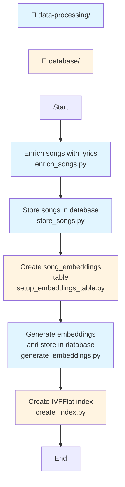

# Data processing

This directory contains scripts for offline processing to build and enrich the database with song data.


## Workflow

In the diagram below, purple nodes represent scripts in the `data-processing` folder and yellow nodes represent scripts in the `database` folder.



1. **Enrich songs with lyrics:**
   ```bash
   python enrich_songs.py
   ```

1. **Store songs in database:**
   ```bash
   python store_songs.py
   ```

1. **Create `song_embeddings` table**
   ```bash
   python ../database/setup_embeddings_table.py
   ```

1. **Generate embeddings:**
   ```bash
   python generate_embeddings.py
   ```

2. Once embeddings are written to the table, **create an IVFFlat index**
   ```bash
   python ../database/create_index.py
   ```

## Scripts

### `enrich_songs.py`
Enriches song data with lyrics from the Genius Song Lyrics dataset on Hugging Face.

**Features:**
- Loads track metadata and user interaction statistics
- Joins with lyrics dataset using exact or normalized matching
- Adds a `has_lyrics` boolean flag to indicate whether lyrics are available

### `store_songs.py`
Stores enriched song data into PostgreSQL database.

**Schema includes:**
- `song_id` (Primary Key)
- `song_name`
- `band`
- `interactions_count`
- `unique_users`
- `avg_interactions_per_user`
- `popularity_score`
- `has_lyrics` (Boolean)
- `lyrics` (Text, nullable)

### `generate_embeddings.py`
Generates vector embeddings for songs and stores them in a separate `song_embeddings` table.

**Embedding generation logic:**
- When `has_lyrics` is `True` AND `lyrics` column is available:
  - Uses: `song_name`, `band`, and `lyrics` for embedding
  - Format: `"{song_name} by {band}\n\n{lyrics}"`
  
- When `has_lyrics` is `False` OR `lyrics` column is unavailable:
  - Uses: Only `song_name` and `band` for embedding
  - Format: `"{song_name} by {band}"`

**Usage:**
```bash
# First-time setup: Create songs cache (faster for subsequent runs)
python generate_embeddings.py --create-songs-cache

# Generate embeddings using parquet cache (10-100x faster song loading)
python generate_embeddings.py --use-songs-cache

# Generate and cache only (no DB upload)
python generate_embeddings.py --generate-only --use-songs-cache

# Upload cached embeddings to database
python generate_embeddings.py --upload-only

# Test with 1000 songs
python generate_embeddings.py --limit=1000
```

**Options:**
- `--limit=N`: Process only N songs
- `--cache-dir=PATH`: Cache directory (default: ~/Documents/song_embeddings)
- `--batch-size=N`: Number of songs per API call (max 2048, default 2048)
- `--workers=N`: Number of parallel workers for API calls (default 8, max 32)
- `--upload-batch-size=N`: Number of embeddings per DB upload batch (default 500000)
- `--upload-only`: Skip generation, only upload cached embeddings to database
- `--generate-only`: Only generate and cache, don't upload to database
- `--no-skip-existing`: Regenerate embeddings even if cached
- `--create-songs-cache`: Create parquet cache of songs table, then exit
- `--use-songs-cache`: Use parquet cache instead of reading from database (faster)
- `--songs-cache=PATH`: Path to songs parquet cache (default: ~/Documents/song_embeddings/songs_cache.parquet)
- `--help` or `-h`: Show help message

**Output:**
Creates a `song_embeddings` table with:
- `song_id` (Primary Key, references songs table)
- `embedding` (Array of floats - vector embedding)

### `check_cache_status.py`
Diagnostic utility script that monitors the embedding cache status during long-running embedding generation processes. It checks the cache directory for total file count, identifies the maximum cached song ID, displays the 10 most recently modified cache files, and determines whether the cache is actively being updated or has stalled (useful for detecting API errors or rate limiting issues).

## Requirements

Install dependencies:
```bash
pip install -r requirements.txt
```

## Environment variables

Required environment variables (use `.env` file):
- `FIREWORKS_API_KEY`: API key for Fireworks AI (for embeddings)
- `POSTGRES_URL`: PostgreSQL connection string (optional, has default)

