# Data processing

This directory contains scripts for offline processing to build and enrich the database with song data.


## Workflow

In the diagram below, purple nodes represent scripts in the `data-processing` folder and yellow nodes represent scripts in the `database` folder.

```mermaid
graph TD
    DP["📁 data-processing/"]
    DB["📁 database/"]
    DP ~~~ DB
    DB ~~~ A
    
    A[Start] --> B["Enrich songs with lyrics<br/>enrich_songs.py"]
    B --> C["Store songs in database<br/>store_songs.py"]
    C --> D["Create song_embeddings<br/>table<br/>setup_embeddings_table.py"]
    D --> E["Generate embeddings<br/>and store in  database<br/>generate_embeddings.py"]
    E --> F["Create IVFFlat index<br/>create_index.py"]
    F --> G[End]
    
    style DP fill:#e1f5ff
    style DB fill:#fff4e1
    style B fill:#e1f5ff
    style C fill:#e1f5ff
    style D fill:#fff4e1
    style E fill:#e1f5ff
    style F fill:#fff4e1
```



1. **Enrich songs with lyrics:**
   ```bash
   python enrich_songs.py
   ```

1. **Store songs in database:**
   ```bash
   python store_songs.py
   ```

1. **Create `song_embeddings` table**
   ```bash
   python ../database/setup_embeddings_table.py
   ```

1. **Generate embeddings:**
   ```bash
   python generate_embeddings.py
   ```

2. Once embeddings are written to the table, **create an IVFFlat index**
   ```bash
   python ../database/create_index.py
   ```

## Scripts

### `enrich_songs.py`
Enriches song data with lyrics from the Genius Song Lyrics dataset on Hugging Face.

**Features:**
- Loads track metadata and user interaction statistics
- Joins with lyrics dataset using exact or normalized matching
- Adds a `has_lyrics` boolean flag to indicate whether lyrics are available

### `store_songs.py`
Stores enriched song data into PostgreSQL database.

**Schema includes:**
- `song_id` (Primary Key)
- `song_name`
- `band`
- `interactions_count`
- `unique_users`
- `avg_interactions_per_user`
- `popularity_score`
- `has_lyrics` (Boolean)
- `lyrics` (Text, nullable)

### `generate_embeddings.py`
Generates vector embeddings for songs and stores them in a separate `song_embeddings` table.

**Embedding generation logic:**
- When `has_lyrics` is `True` AND `lyrics` column is available:
  - Uses: `song_name`, `band`, and `lyrics` for embedding
  - Format: `"{song_name} by {band}\n\n{lyrics}"`
  
- When `has_lyrics` is `False` OR `lyrics` column is unavailable:
  - Uses: Only `song_name` and `band` for embedding
  - Format: `"{song_name} by {band}"`

**Usage:**
```bash
# Generate embeddings for all songs
python generate_embeddings.py

# Process only 100 songs
python generate_embeddings.py --limit=100

# Use specific table and batch size
python generate_embeddings.py --table=songs --batch-size=50
```

**Options:**
- `--limit=N`: Process only N songs
- `--table=NAME`: Read from specific table (default: 'songs')
- `--batch-size=N`: Number of songs per API call (max 2048, default 100)
- `--help` or `-h`: Show help message

**Output:**
Creates a `song_embeddings` table with:
- `song_id` (Primary Key, references songs table)
- `embedding` (Array of floats - vector embedding)
- `text_used` (Text snippet showing what was embedded)

### `language.py`
Utility script for detecting and analyzing language distribution in song names.

## Requirements

Install dependencies:
```bash
pip install -r requirements.txt
```

## Environment variables

Required environment variables (use `.env` file):
- `FIREWORKS_API_KEY`: API key for Fireworks AI (for embeddings)
- `POSTGRES_URL`: PostgreSQL connection string (optional, has default)
